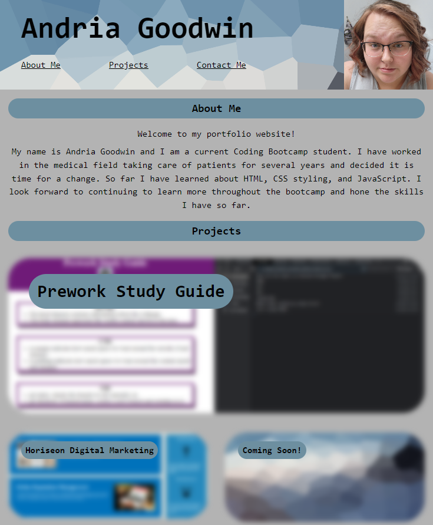
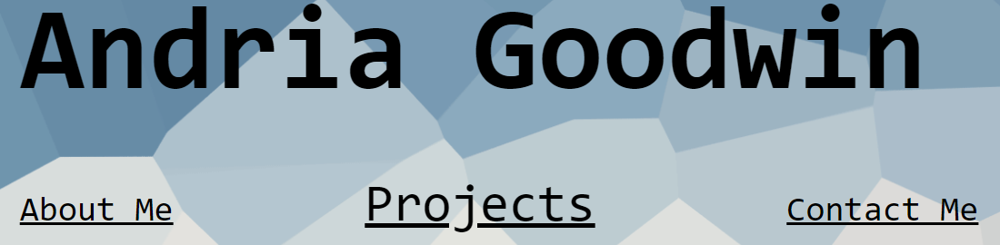
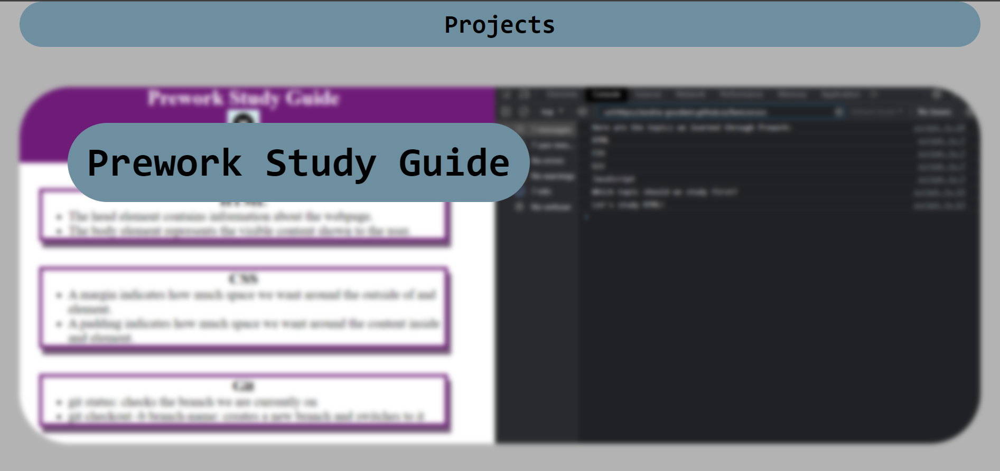
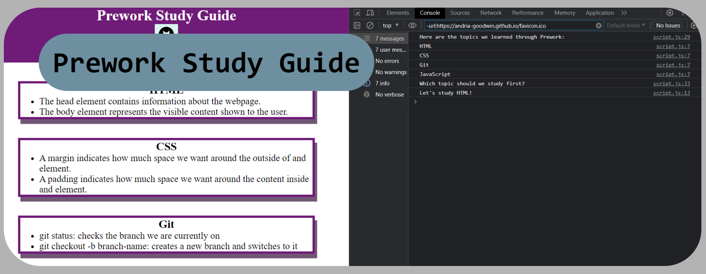
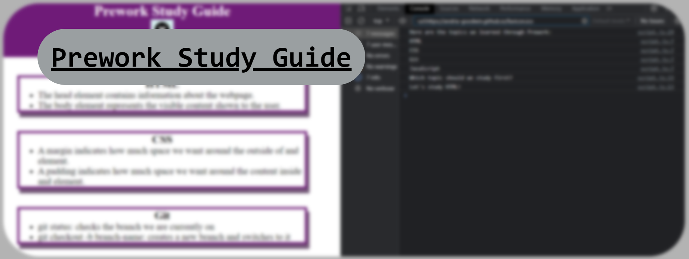
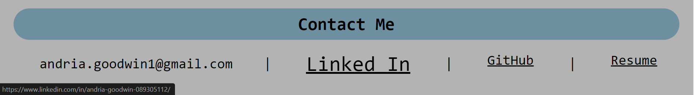

# Portfolio Challenge

## Description

The portfolio challenge is the Module 02 project for coding bootcamp. I built this project to showcase the skills I've learned so far to employers. I did not have a portfolio before this project and having an online one will make it more available to potential employers. I learned a lot more about advanced CSS techniques and building a website from the ground up.

## Installation

N/A

## Usage

The portfolio features a heading with page navigation as well as sections including: About Me, Projects, and Contact Me.

    

The heading section contains navigation links that, when clicked, will redirect you to the corresponding section of the page.

    

    

The Project section contains cards elements that are clickable links to my other projects. When each image is hovered it will unblur, while if the title is hovered it will changed color. Clicking in either place will result in opening the corresponding project.

    

    

The Contact Me section contains information and clickable links to either contact me or find more information about me or my work.

    

## Credits

Placeholder. ProHygiene. (2020). https://prohygiene.com/usa/home/placeholder-2/ 

## License

Please refer to the LICENSE in the repo.